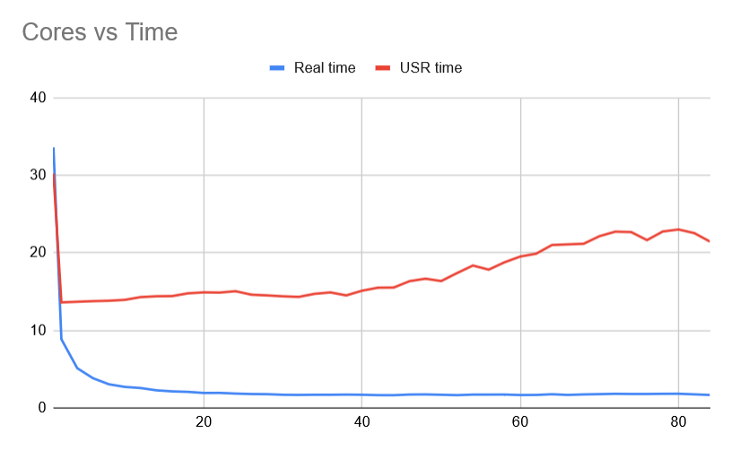
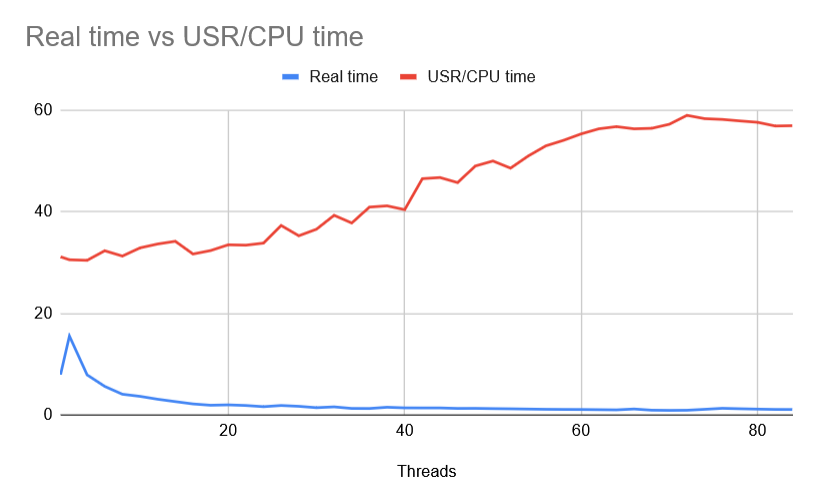

# Threaded project

## Computing Mean

The threaded program takes much less time to complete the calculation, but there are diminishing returns after about 10 cores, and virtually no gain after 32 cores. The time converges at about 1.7 seconds which happens at 32 cores, so any more than that is unnecessary. 
- You do not get linear scaling as you add more cores
- for the maximum speed equation:
 T = (1 - p)T + pT
    - I would say p (fraction of your program that is run in parallel) would be about 0.95, as the time the multithreaded program converges to is 5% of the total serial time. So the 5% that can't be cut out is most likely the serial part, leaving the rest to be parallelized. 

- The kernel takes 4 bytes per iteration. With the single thread, the bandwidth is 1.0 GB/s. With peak speed on 32 threads, the bandwidth is 20 times that at 20.1 GB/s 

## Computing Volume

The threaded program also takes less time to complete, but only after 4 threads. The 2 threaded operation takes more time. I'm assuming because the 2 threads are virtual, and live on the same core, so theres no real time gain just jumping around. However after that, there are consistant gains until 70 threads. The time converges to around 1 second +- -.1s.

